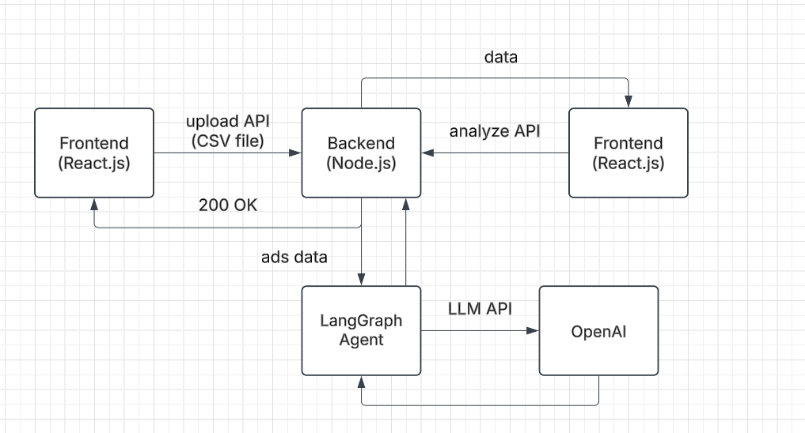

# Ad Performance Analyzer Backend
This is the backend of an Ad Performance Analyzer web application built using Node.js & Express.js leveraging LangChain LLM framework & OpenAI LLM API.

---

## Features
- **File Processing:** Accept CSV input files for bulk ad data processing.
- **Ad Performance Summary:** Generate concise summaries of ad performance based on input data.
- **Suggestions for Improvement:** Provide actionable insights to enhance ad performance.
- **Keyword Analysis:** Identify high-performing and low-performing keywords.

---

## Tech Stack
- **Node.js:** JavaScript runtime for building server-side applications.
- **Express.js:** Web framework for handling API routes.
- **Multer:** Middleware for handling file uploads.
- **CSV Parser:** Library for parsing and processing CSV files.
- **LangChain:** LLM Framework
- **OpenAI:** LLM API
- **Hosting:** Render

---

## Installation

1. **Clone the Repository:**
   ```bash
   git clone https://github.com/Priyanka-Agrawal2022/Ad_Performance_Analyzer_Agent_Backend.git
   ```

2. **Install Dependencies:**
   ```bash
   npm install
   ```

3. **Set Up Environment Variables:**
   Create a `.env` file in the root directory and add the required environment variables.

---

## Environment Variables
The application requires the following environment variables:

```env
PORT=8000
OPENAI_API_KEY=your_openai_api_key
```

---

## API Endpoints

### 1. **Upload Ad Data**
**Endpoint:** `/upload`
- **Method:** `POST`
- **Description:** Accepts a CSV file containing ad data.
- **Request:**
  - Content-Type: `multipart/form-data`
  - File: `file` (key for the uploaded CSV file)
- **Response:**
  - `200 OK`: Upload results.
  - `400 Bad Request`: If the file is invalid or missing.
  - `500 Internal Server Error`: If error occurs during file upload.

### 2. **Analyze Ad Data**
**Endpoint:** `/analyze`
- **Method:** `GET`
- **Description:** Analyzes ad performance by parsing CSV file stored in uploads folder & deletes it after parsing.
- **Response:**
  - `200 OK`: Analysis summary, high performing & low performing keywords.
  - `500 Internal Server Error`: If error occurs during file analysis.

---

## Architecture Diagram

---

## Running the Server
   ```bash
   npm start
   ```
   The server will start at `http://localhost:8000`.

---

## Error Handling
- **Insufficient Quota:** Check your OpenAI API usage and adjust your plan if needed.
- **Invalid File Format:** Ensure uploaded files are in CSV format.
- **API Errors:** Refer to OpenAI API documentation for details on error codes.

---

## Assumptions
- **Target Audience:** The primary users of this tool are digital marketers, advertisers, and e-commerce sellers managing online ad campaigns. They have basic familiarity with ad performance metrics like ROAS, ACOS, CTR, and Conversion Rates.
- **Data Format:** The ad performance data is assumed to be provided in a CSV file with specific header names.
- **API Key Configuration:** Users deploying the backend are expected to configure their API keys like OpenAPI key securely via environment variables.
- **Single User Context:** The current version assumes a single user or session at a time and does not include multi-user or role-based access features.
- **Static Metrics Definitions:** Metrics like "high ROAS" or "low ACOS" have predefined thresholds and are not dynamically adjusted based on industry-specific benchmarks.

---

## Future Improvements
- **User Authentication and Authorization:** Implement user login and role-based access to ensure data security and personalized user experience. Each user can manage their own campaigns securely.
- **Dashboard and Visual Analytics:** Introduce a dashboard with graphical visualizations (charts, graphs, etc.) for key performance metrics like ROAS, ACOS, CTR, and Conversion Rates.
- **Integration with Ad Platforms:** Automate data fetching by integrating with ad platforms (e.g., Google Ads, Amazon Ads) via APIs to avoid manual CSV uploads.
- **Multi-Language Support:** Enable multi-language support in the frontend to make the tool accessible to non-English speaking users.
- **Real-Time Notifications and Alerts:** Implement a system to notify users of critical performance changes via email or push notifications, such as a sudden drop in ROAS or high ACOS for a specific keyword.